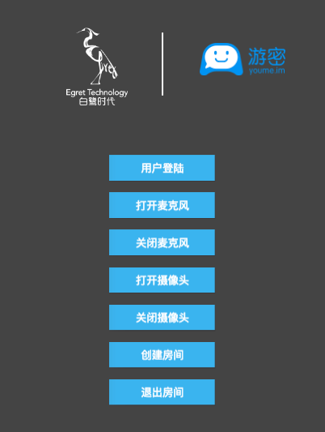

# 白鹭引擎中如何使用游密实时语音 SDK
### 一.去游密官网注册账号，获取 `Appid` 和 `accountType `
[https://www.youme.im/talk.html](https://www.youme.im/talk.html)

### 二.下载游密的白鹭引擎第三方库。
[https://github.com/egret-labs/egret-game-library/tree/5.1.x/youmi](https://github.com/egret-labs/egret-game-library/tree/5.1.x/youmi)

里面包含 `libsrc`(第三方库)、`demo`(示例 demo) 和 `doc`(相关文档) 三个文件夹。


#### 1) demo 文件夹
里面是一个接入了实时语音的示例 demo，包含每个 API 的使用方法。运行效果如下：



#### 2) doc 文件夹
里面包含游密的对接文档和 API 说明。以及如何计算 `usersig` 的方法和配套的 java 的 jar 包。


### 三. 在 Egret 项目中使用游密 SDK
#### 1) 添加第三方库
在 Egret 工程中打开 `egretProperties.json`,添加游密的配置。可以参考示例 demo。

```
"modules": [
    {
      "name": "youmi",
      "path": "../libsrc"
    }
]
```

在命令行中运行 `egret build -e` ，游密的 sdk 就自动引入了。

#### 2) 修改游戏页面
打开 `index.html` 文件，把下面这段代码添加进入。游密 SDK 需要使用一些 `div` 标签来播放语音。

```
<div id="audioContainer">
    <audio id="localVideo" autoplay playsinline muted></audio>
</div>
<div id="userContainer" style="display: none;">
</div>
<script src="https://sqimg.qq.com/expert_qq/webrtc/1.2/WebRTCAPI.min.js"></script>
```


### 四. 注意事项
* 游密语音 SDK 必须在 `https` 环境下使用
* 如果使用没有麦克风和摄像头的电脑运行和调试，可能会报错。
* 对 `iOS` 系统支持不完善。完整的平台支持列表如下：

| 操作系统平台 | 浏览器/webview | 版本要求 | 备注 |
| :---------- | :------------ | :------- | :--- |
| iOS | Safari (Only) | 11.1.2 | 由于Safari的实现仍然bug，产品化方案建议先规避，待苹果解决后再使用 |
| Android | TBS | 43600 ||
| Android | Chrome | 60+ | 需要支持 H264 |
| Mac | Chrome | 47+ ||
| Windows(PC) | Chrome | 52+ ||


